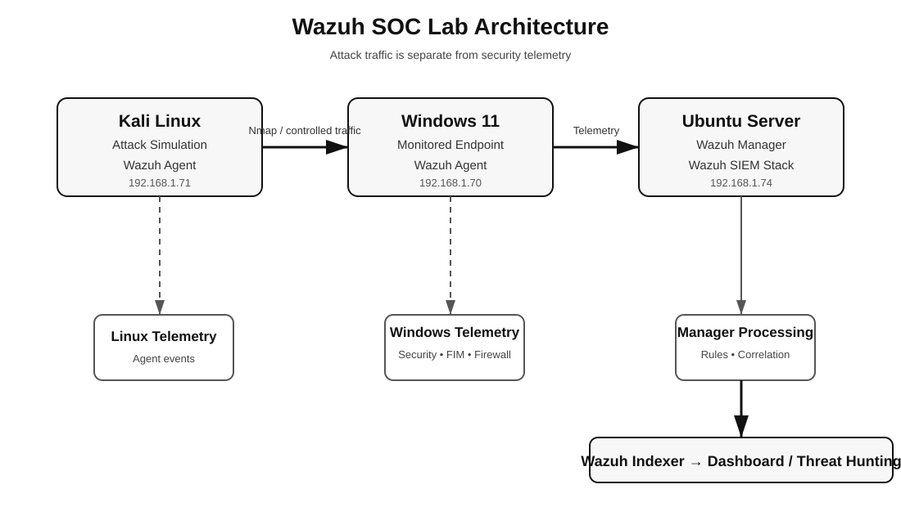

# Wazuh-Based Security Monitoring and Threat Hunting SOC Lab

This is a small, hands-on SOC lab I built to learn how Wazuh works in a real monitoring setup. I used Ubuntu Server as the Wazuh server, Windows 11 as the main monitored endpoint, and Kali Linux for controlled attack testing and Linux telemetry.

The lab covers endpoint monitoring, File Integrity Monitoring (FIM), Windows Security events, Windows Firewall logs, Nmap scan detection, alert correlation, and MITRE ATT&CK-based investigation.

> All testing was carried out in a private lab using systems available to me for authorized testing.

## Project Report

- [Detailed report](reports/WAZUH-Project-Report.md)
- [Project report PDF](reports/WAZUH_Project_Report.pdf)

## Lab Setup

| System | Role | IP Address | Version |
|---|---|---:|---|
| Ubuntu Server | Wazuh Manager / SIEM | `192.168.1.74` | Wazuh 4.14.5 |
| Windows 11 | Monitored endpoint / Wazuh Agent | `192.168.1.70` | Wazuh Agent 4.7.5 |
| Kali Linux | Attack testing / Wazuh Agent | `192.168.1.71` | Wazuh Agent 4.14.5 |

## How the Lab Works

**Attack traffic:**

```text
Kali Linux → Nmap / controlled traffic → Windows 11
```

**Security telemetry:**

```text
Windows Wazuh Agent ─┐
                     ├→ Wazuh Manager → Wazuh Indexer → Dashboard / Threat Hunting
Kali Wazuh Agent ────┘
```

Kali was used to generate controlled reconnaissance traffic. The Wazuh agents collected endpoint activity and sent it to the manager, where the events were processed and correlated before being reviewed in the dashboard.



[Architecture notes](architecture/README.md)

## What I Set Up

- Wazuh Manager, Indexer, and Dashboard on Ubuntu Server
- Wazuh Agent on Windows 11
- Wazuh Agent on Kali Linux
- FIM for `C:\Users\Public`
- Windows Security Event collection
- Windows Firewall log collection from `pfirewall.log`
- Controlled Nmap SYN scans from Kali
- MITRE ATT&CK review through Wazuh Threat Hunting

## Detection Tests

### File and Registry Integrity

I monitored `C:\Users\Public` and reviewed the integrity events produced during testing. The dashboard showed Rules **550**, **594**, and **750** for integrity-related activity.

The registry events were treated as investigation leads. A registry change by itself does not prove persistence or compromise, because normal Windows activity can also change registry data.

[View FIM notes](detections/file-integrity-monitoring.md)

### Account and Authentication Monitoring

I tested local account creation and failed logons using Windows Security events:

- Event ID **4720** — user account created
- Event ID **4625** — failed logon
- Rule **60122** — observed for logon-failure activity

[View authentication notes](detections/authentication-monitoring.md)

### Nmap Scan Detection

From Kali I ran:

```bash
nmap -sS 192.168.1.70
```

Windows Firewall logging was collected from:

```text
C:\Windows\System32\LogFiles\Firewall\pfirewall.log
```

Wazuh correlated repeated firewall-drop events and produced:

| Rule | Description | Level |
|---|---|---:|
| **4151** | Multiple Firewall drop events from same source | **10** |

One high-level Rule 4151 alert can represent several underlying firewall events, so running several scans does not necessarily mean one Rule 4151 alert for each scan.

[View the network scan detection notes](detections/network-scan-detection.md)

## My Investigation Process

When an alert appeared, I checked the endpoint, timestamp, source information, rule ID, severity, and nearby events. I then compared the activity with the expected lab action and used MITRE ATT&CK as additional context.

For a real production alert, the next step would depend on the evidence. That could include blocking a source, disabling an unauthorized account, resetting credentials, isolating a host, or escalating the incident. I did not run automated containment in this lab.

## Troubleshooting

A useful part of this project was fixing the problems that came up during setup.

- The Kali agent was initially trying to reach the manager on TCP/5601. I corrected the agent configuration to use TCP/1514.
- The Kali 4.14.5 agent could not register with the older manager, so I upgraded the Wazuh server stack to 4.14.5.
- Windows Firewall events were missing until firewall logging and the Wazuh `localfile` configuration were corrected.
- An XML configuration error stopped log collection until the syntax was fixed and the agent restarted.

## Configuration Examples

I included sanitized configuration examples under [`configuration/`](configuration/README.md). They use placeholders and do not contain credentials or API keys.

## Evidence

The [`screenshots/`](screenshots/) folder contains the screenshots captured from the lab. The screenshot guide explains what each image shows and which part of the project it supports.

## What Is Not Part of the Completed Lab

I have not claimed the following as completed features:

- Sysmon integration
- VirusTotal or other threat-intelligence enrichment
- Custom Wazuh detection rules
- Automated containment / active response

They are listed separately as future work.

## Repository Layout

```text
.
├── architecture/
│   ├── README.md
│   └── wazuh-soc-architecture.svg
├── comparison/
├── configuration/
│   ├── README.md
│   ├── firewall-localfile.xml
│   └── windows-agent-ossec.conf.example
├── detections/
│   ├── authentication-monitoring.md
│   ├── file-integrity-monitoring.md
│   └── network-scan-detection.md
├── future-work/
│   └── README.md
├── reports/
│   ├── WAZUH-Project-Report.md
│   └── WAZUH_Project_Report.pdf
├── rules/
│   └── README.md
├── screenshots/
│   └── README.md
└── README.md
```

## Author

**Ibrahim Khaleel M**
